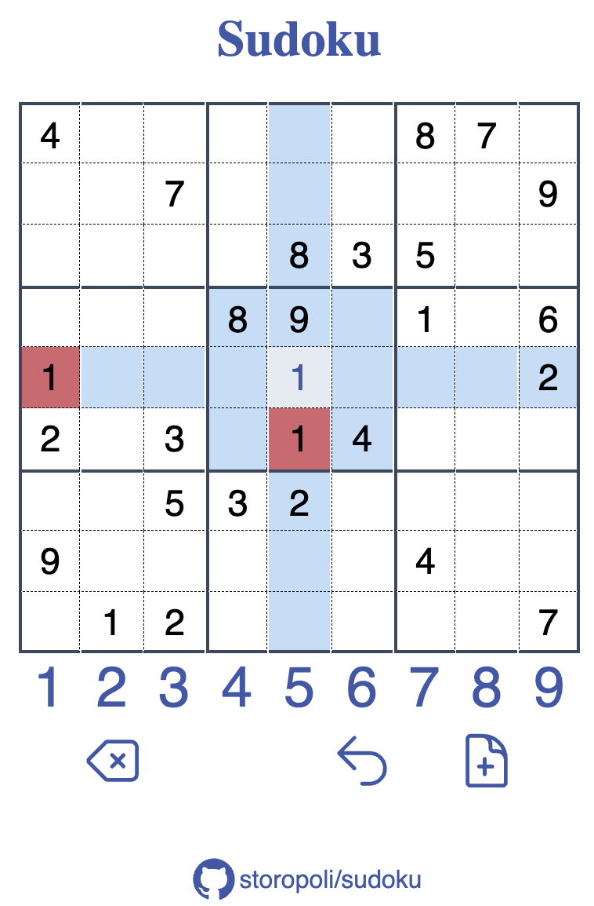

# Sudoku

[](https://opensource.org/license/mit/)

<div align="center">
    
</div>

I tell the history of this game in the [blog post](https://storopoli.com/blog/2024-01-30-sudoku/).

## Performance

🔫
This is the fastest Sudoku game in the West!

- Built with [Rust 🦀](https://rust-lang.org)
  and [Dioxus](https://dioxuslabs.com).
- Compiles to [Web Assembly (WASM)](https://webassembly.org/).
- Efficient stack-allocated data structures with `&str` and `u8` everywhere.
- Fast sudoku generation and solution finding using the [`sudoku`](https://lib.rs/sudoku) crate.

After seeing my mom playing her favorite game in an ad-plagued spyware in
her mobile phone, I've built this for her.

## Deployment

A Docker Compose file is provided to build and run the application.

```bash
docker-compose up --detach
```

The application will be available at `http://localhost:1005`.

## License

The source code is licensed under a
[MIT License](https://opensource.org/license/mit/).

[](https://opensource.org/license/mit/)
