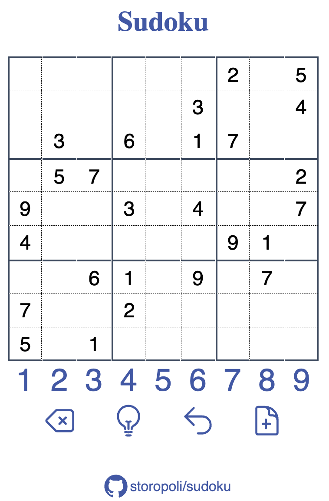

# Sudoku

<!-- FIXME: add a screenshot -->

    

## Performance

<!-- FIXME: add information -->
- Rust
- WASM
- `&str` and `u8`

## License

The source code is licensed under a
[MIT License](https://opensource.org/license/mit/).

